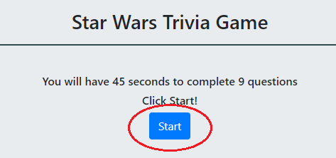
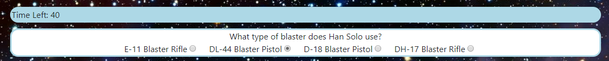

# Star-Wars-Trivia-Game

The Star-Wars-Trivia-Game application asks the user a series of Star Wars related trivia questions. Questions are evaluated for correctness, and a score is presented.

The application is deployed to github, and can be accessed at https://gavinquirk.github.io/Star-Wars-Trivia-Game/

Open in Chrome Inspector or similar tool to see logs of your correct answers after submission!

Begin a new instance of the quiz by pressing the Start button

  * Quiz questions will populate the page
  * Click to store your answers
  * Remaining time is displayed on the top left
  * You will have 5 seconds per question, for a total of 45 seconds for 9 questions

Press Done to finish the quiz, or wait for time to run out

After the quiz is done, you will be presented with the amount of questions you got correct

If you want to see which answers you got correct, open the inspector (Ctrl + Shift + I) in Chrome or other web browser
